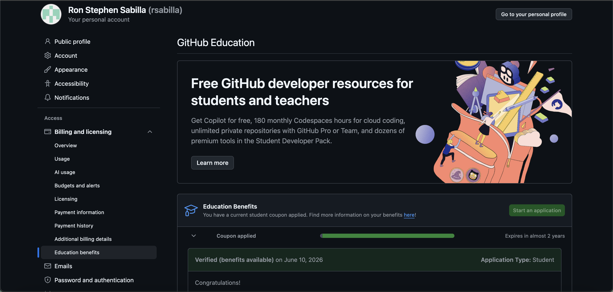

# Introduction {#sec-intro}

> "Learning a new tool can feel overwhelming at first, but the right environment makes all the difference."

This report reflects on my experience **downloading**, **installing**, and **getting familiar with Positron** — a newer data science tool built by Posit. I will share what I liked about it compared to RStudio, how I used AI inside Positron, and my experience with GitHub Copilot.[^1]

[^1]: Positron is currently in public beta. You can download it at <https://github.com/posit-dev/positron/releases>

::: callout-note
## About This Report

This report was written using **Quarto** inside **Positron** as part of the W06 Reflection Essay assignment. It covers all four essay prompts and includes formatting features like tabsets, callouts, footnotes, and code examples.
:::

------------------------------------------------------------------------

# Downloading and Installing Positron {#sec-install}

## What is Positron?

Positron is a newer IDE (coding environment) made by the same team behind RStudio. It is built on top of **Visual Studio Code**, which means it looks and feels a bit different from RStudio but works with both **R and Python**. Think of it as a more modern and flexible version of RStudio that connects to a lot more tools and extensions.

## How to Install It

Installing Positron is pretty straightforward:

1.  Go to the [Positron releases page](https://github.com/posit-dev/positron/releases)
2.  Download the version for your computer (Windows or Mac)
3.  Run the installer and follow the steps
4.  Open Positron — it will automatically find your R installation
5.  Create a project folder on your computer and open it in Positron

::: callout-tip
## Project Folder Tip

When you open a folder as a project in Positron, it creates a `.positron` folder automatically. This saves your settings so everything is ready to go the next time you open it.
:::



------------------------------------------------------------------------

# Positron vs. RStudio {#sec-compare}

## Prompt

*Based on what you learned from Step 1 and Step 3, what do you like about Positron compared with RStudio?*

## My Response

After going through the videos and trying Positron out myself, I can say that Positron feels like an **easier and more connected version of RStudio**. The two tools work together well, and Positron makes it easier to code and understand what is going on in your project.

My favorite feature by far is the **AI Assistant**. You can ask it anything — whether you need help writing code, building a chart, or collecting data — and it will give you suggestions right away. That kind of support makes the whole experience a lot less intimidating, especially when you are still learning.

Positron also connects to a lot of useful extensions like **Claude**, **GitHub**, and others, which makes it feel like a much more powerful workspace compared to a basic RStudio setup.

::: panel-tabset
### What I Like About Positron

- The layout feels clean and easy to navigate
- The AI Assistant is built right in and easy to access
- It connects to extensions like GitHub and Claude
- It supports both R and Python in the same place
- The Variable Explorer is easier to read than RStudio's Environment tab

### How It Compares to RStudio

| Feature         | RStudio         | Positron               |
|-----------------|-----------------|------------------------|
| AI Assistant    | ❌ Not built in | ✅ Built in            |
| Python support  | Limited         | ✅ Full support        |
| Extensions      | R add-ins only  | VS Code marketplace    |
| Theme options   | Limited         | Many options           |
| Git integration | Basic           | More visual and easier |
:::

::: callout-note
## My Take

For someone still learning R, Positron felt more supportive and modern. RStudio is still great, but Positron gives you more tools right out of the box — especially the AI features.
:::

------------------------------------------------------------------------

# Using AI Inside Positron {#sec-ai}

## Prompt 3.1 — Describing the Ways to Use AI {#sec-ai-ways}

*Describe the various ways you can use AI inside Positron. Some are free while others are not.*

## My Response

One of the biggest takeaways I had from this assignment was learning how useful AI can be when working in Positron and R. My favorite feature is having the **AI Assistant available while coding** because it makes the learning process much less overwhelming.

Whenever I forget a specific piece of code, run into an error, or am unsure how to create a chart, the AI Assistant can provide guidance and help me troubleshoot quickly. Instead of spending a long time searching online for answers, I can get immediate support and keep working on my project more efficiently.

The AI Assistant was especially helpful when **building visualizations and analyzing data** — it could suggest the correct code for charts, explain what the code was doing, and help me understand the results. As someone still developing my R skills, having that support increased my confidence and made it easier to complete tasks that would have otherwise taken much longer.

Overall, the AI Assistant in Positron is a valuable learning tool that not only helps solve problems but also helps users become better programmers over time.

::: panel-tabset
### Free AI Tools

| Tool | What It Does |
|------------------------------------|------------------------------------|
| **GitHub Copilot** (Education) | Code suggestions + chat, free for students |
| **Positron AI Assistant** | Built-in chat sidebar, already in Positron |
| **Codeium** | Inline code autocomplete, free tier available |
| **Continue + Ollama** | Local AI that works offline |

### Paid AI Tools

| Tool                            | What It Does            | Cost         |
|---------------------------------|-------------------------|--------------|
| **GitHub Copilot** (Individual) | Code suggestions + chat | \~\$10/month |
| **Cursor**                      | AI-powered IDE          | \~\$20/month |
| **Continue + Claude API**       | Chat powered by Claude  | Pay per use  |
:::

------------------------------------------------------------------------

## Prompt 3.2 — AI Tools I Set Up {#sec-ai-setup}

*Which AI tools have you installed or set up? Which AI tools did you find beneficial for you?*

## My Response

One of the AI tools I installed is **GitHub Copilot**, which is connected to the Positron AI Assistant. It has been very beneficial in helping me complete coding tasks more efficiently and solve problems when I get stuck.

I especially find it useful when:

- **Searching for datasets** — Copilot can suggest where to find data and how to load it into R
- **Generating chart code** — I can describe what I want and it writes the code for me
- **Fixing errors** — When something breaks, I can paste the error and ask what went wrong

These features help me stay organized and make data analysis much easier to understand. Overall, GitHub Copilot and the Positron AI Assistant have become valuable tools that improve both my **productivity** and my **learning experience**.

::: callout-tip
## Why I Recommend GitHub Copilot

It is free for students through the GitHub Education program. Once it is set up, it works directly inside Positron and feels like having a coding partner available at all times.
:::

------------------------------------------------------------------------

## Prompt 3.3 — GitHub Copilot Education Account {#sec-copilot}

*Apply for the GitHub Education account and share whether you found Copilot helpful or distracting.*

### Applying for GitHub Education

::: callout-note
## How to Apply

1.  Go to <https://education.github.com>
2.  Click **"Get benefits for students"**
3.  Sign in with your GitHub account
4.  Verify your student status using your `.edu` email or a school ID
5.  Once approved, go to your GitHub settings and enable Copilot
6.  Install the **GitHub Copilot** extension inside Positron
:::

> **Screenshot:** *Add your GitHub Education approval screenshot here.*

### Was Copilot Helpful or Distracting?

Using GitHub Copilot was **very helpful** overall. I tested it by asking it different questions and giving it different coding tasks to see if the suggestions actually worked — and most of the time they did.

::: panel-tabset
#### What Was Helpful

- Asking it coding questions felt natural, like texting someone for help
- It saved a lot of time when I did not know the exact syntax for something
- Testing different prompts and seeing how it responded helped me learn faster
- It gave working code most of the time, which built my confidence

#### What to Watch Out For

- Sometimes the suggestions need small adjustments before they work perfectly
- It is easy to rely on it too much without fully understanding what the code does
- It is best used as a **helper**, not a replacement for learning

#### My Overall Verdict

Overall, Copilot felt more **helpful than distracting**. It is like having a knowledgeable friend you can ask questions at any time. For someone still learning R, that kind of support is really valuable — especially when you just need a quick answer to keep moving forward.
:::

------------------------------------------------------------------------

# Publishing to GitHub Pages {#sec-publish}

## Prompt

*Publish this report to GitHub Pages and provide a URL. Note that GitHub Pages and a GitHub repo are different — GitHub Pages is a website that hosts your rendered HTML file.*

## Steps I Followed

Publishing the report to GitHub Pages involved a few steps:[^2]

[^2]: GitHub Pages creates a public website from your files. The format of the URL is usually: `https://yourusername.github.io/your-repo-name/`

1.  Rendered the `.qmd` file to HTML inside Positron using `Ctrl+Shift+K`
2.  Created a new repository on GitHub at <https://github.com/new>
3.  Pushed the project folder (including the HTML file) to the repository
4.  Went to **Settings → Pages** inside the GitHub repo
5.  Selected the `main` branch as the source and saved
6.  GitHub generated a public URL for the report

::: callout-tip
## Quick Tip

Rename your HTML file to `index.html` before pushing so that GitHub Pages loads it automatically when someone visits your URL — no need to click into a file name.
:::

## My GitHub Pages URL

> **URL:** *Paste your GitHub Pages link here, for example: https://yourusername.github.io/Intro-Positron/*

------------------------------------------------------------------------

# Summary {#sec-summary}

This assignment gave me hands-on experience with Positron as a modern data science tool. Here is what I took away from it:

- Positron feels like a **more modern and connected version of RStudio**, especially with its AI features
- The **AI Assistant** is the standout feature — it makes coding much less intimidating for beginners
- **GitHub Copilot** (free through GitHub Education) is a great tool that helped me code faster and learn more along the way
- Publishing to **GitHub Pages** turns your report into a real website anyone can visit

::: callout-note
## Final Thought

For anyone just starting out with R and data science, Positron is worth exploring. It has the tools you need to learn, build, and share your work — all in one place.
:::

------------------------------------------------------------------------

# Appendix: Code Examples {#sec-appendix}

These examples show a few basic R code chunks with different display options.

## Basic Summary (Code Visible)

```{r}
#| label: basic-summary
#| echo: true

# Basic summary statistics
scores <- c(85, 90, 78, 92, 88, 76, 95, 83)

cat("Student Score Summary\n")
cat("=====================\n")
cat("Average score: ", mean(scores), "\n")
cat("Highest score: ", max(scores), "\n")
cat("Lowest score:  ", min(scores), "\n")
```

## Code Folded (Click to Expand)

```{r}
#| label: folded-example
#| code-fold: true
#| code-summary: "Click to see the code"

# This code is hidden by default but can be expanded
numbers <- 1:10
cat("Numbers 1 through 10:", numbers, "\n")
cat("Their sum is:", sum(numbers), "\n")
cat("Their average is:", mean(numbers), "\n")
```

## Hidden Code (Output Only)

```{r}
#| label: hidden-example
#| echo: false

# This code is completely hidden — only the output shows
cat("This output appears in the report, but the code is invisible to the reader.\n")
```

::: callout-note
## What These Examples Show

- **First chunk** — Code is fully visible (`echo: true`)
- **Second chunk** — Code is folded and hidden by default but can be expanded by the reader
- **Third chunk** — Code is completely hidden (`echo: false`), only the output shows
- The `code-tools: true` setting in the YAML adds a button at the top of the page to show or hide all code at once
:::
